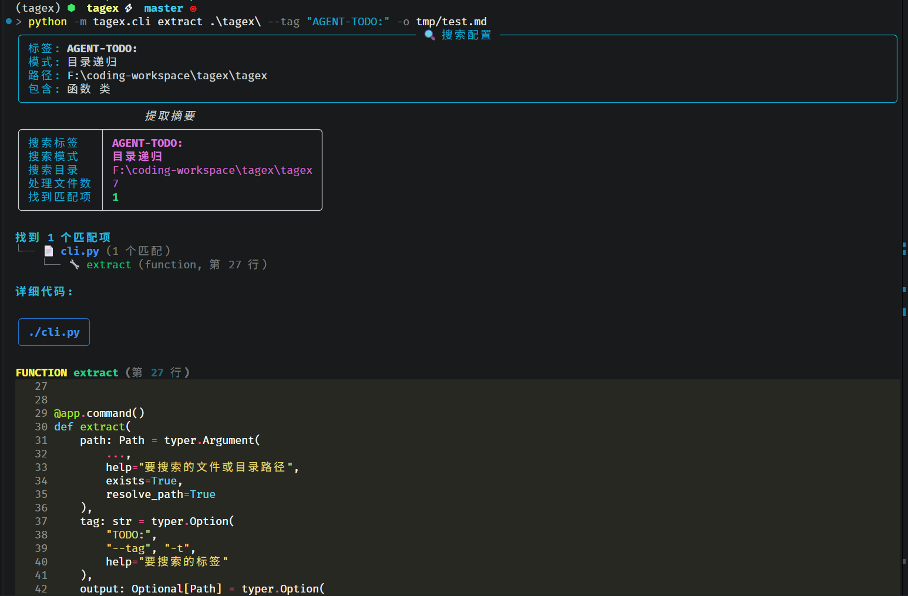

# TagEx - Tag Extractor

🔍 一个用于从 Python 代码中提取特定标签（如 TODO、FIXME、AGENT-TODO 等）的命令行工具。

## 功能特性

- ✅ 支持单文件和目录递归搜索
- ✅ 提取函数和类中的标签
- ✅ 多种输出格式（Markdown、纯文本、表格视图）
- ✅ 美化的终端输出（使用 Rich）
- ✅ 高覆盖率测试（91%+）
- ✅ 完整的类型检查（mypy）
- ✅ 可作为 uv tool 安装

## 项目目的

TagEx 是一个用于从 Python 代码中提取特定标签（如 TODO、FIXME、AGENT-TODO 等）的命令行工具。项目框架编写中，通过对应的 agent tag，提取出 AI 应该完成的部分，喂给 AI 编码助手来完成对应的代码片段。

## 安装

### 使用 uvx 快速运行（推荐）

```bash
# 直接从 GitHub 仓库运行，无需安装
uvx --from git+https://github.com/Lerr1uqs/tagex.git tagex extract -t "AGENT-TODO:" ./tagex
```

### 使用 uv 安装（推荐）

```bash
# 从本地安装
uv tool install .

# 或从 Git 仓库安装
uv tool install git+https://github.com/Lerr1uqs/tagex.git
```

### 手动安装

```bash
# 克隆仓库
git clone https://github.com/Lerr1uqs/tagex.git
cd tagex

# 同步依赖
uv sync

# 激活虚拟环境
.venv\Scripts\activate  # Windows
# 或
source .venv/bin/activate  # Linux/Mac
```

## 使用方法

### 基本用法

```bash
# 查看帮助信息
tagex --help

# 查看版本信息
tagex version

# 查看子命令帮助
tagex extract --help

# 搜索单个文件中的 TODO 标签
tagex extract myfile.py --tag "TODO:"

# 搜索目录中的所有 TODO 标签
tagex extract ./src --tag "TODO:"

# 搜索 AGENT-TODO 标签（用于 AI Agent 任务）
tagex extract ./src --tag "AGENT-TODO:"
```

### 输出选项

```bash
# 保存为 Markdown 文件
tagex extract ./src --tag "TODO:" --output todos.md

# 保存为纯文本文件
tagex extract ./src --tag "TODO:" --output todos.txt --format plain

# 表格视图
tagex extract ./src --tag "TODO:" --table

# 不显示代码，只显示位置
tagex extract ./src --tag "TODO:" --no-code
```

### 过滤选项

```bash
# 只搜索函数（不包含类）
tagex extract ./src --tag "TODO:" --no-classes

# 只搜索类（不包含函数）
tagex extract ./src --tag "TODO:" --no-functions

# 静默模式（不显示进度）
tagex extract ./src --tag "TODO:" --quiet
```

### 组合使用

```bash
# 搜索目录，保存为 Markdown，只显示函数
tagex extract ./src \
    --tag "FIXME:" \
    --no-classes \
    --output reports/fixme_functions.md

# 表格视图，静默模式
tagex extract ./src \
    --tag "AGENT-TODO:" \
    --table \
    --quiet

# 搜索单个文件，输出为纯文本
tagex extract ./src/utils.py \
    --tag "TODO:" \
    --format plain \
    --output utils_todos.txt
```

### 常见用例

#### 1. 提取 AI Agent 任务

TagEx 特别设计用于 AI 编码助手工作流。通过在代码中添加 `AGENT-TODO:` 标签，可以标记需要 AI 完成的任务片段，然后使用 TagEx 提取这些任务供 AI 处理。

```bash
# 搜索所有 AGENT-TODO 标签，保存为 Markdown
tagex extract ./ --tag "AGENT-TODO:" --output agent_tasks.md

# 使用 uvx 快速运行
uvx --from git+https://github.com/Lerr1uqs/tagex.git tagex extract -t "AGENT-TODO:" ./tagex

# 只搜索函数中的 AGENT-TODO
tagex extract ./ --tag "AGENT-TODO:" --no-classes --table
```

**使用示例：**

在代码中标记 AI 任务：
```python
def process_data(data: List[Dict]) -> Dict:
    # AGENT-TODO: 实现数据验证逻辑，确保所有必需字段都存在
    # AGENT-TODO: 添加异常处理，处理无效数据格式
    pass
```

提取任务后，可以将结果直接提供给 AI 编码助手来完成对应的代码片段。

#### 2. 生成代码审查报告

```bash
# 搜索所有 FIXME，生成详细报告
tagex extract ./src --tag "FIXME:" --output fixme_report.md

# 只显示位置，不显示代码
tagex extract ./src --tag "FIXME:" --no-code --output fixme_list.txt
```

#### 3. 检查遗留代码

```bash
# 搜索所有 TODO 标签
tagex extract ./ --tag "TODO:" --table

# 搜索特定目录
tagex extract ./src --tag "HACK:" --output hacks.md
```

## 输出示例

### 实际运行效果



### 树形视图（默认）

```
找到 2 个匹配项
├── 📄 core/extractor.py (1 个匹配)
│   └── 🔧 extract (function, 第 78 行)
└── 📄 core/formatter.py (1 个匹配)
    └── 🔧 print_summary (function, 第 48 行)
```

### 表格视图

```
┏━━━━━━━━━━━━━━━━┳━━━━━━━━┳━━━━━━━━━━━━┳━━━━━━━┓
┃ 文件路径        ┃ 类型    ┃ 名称        ┃ 行号   ┃
┡━━━━━━━━━━━━━━━━╇━━━━━━━━╇━━━━━━━━━━━━╇━━━━━━━┩
│ ./core/extractor.py │ 🔧 function │ extract │ 78   │
│ ./core/formatter.py │ 🔧 function │ print_summary │ 48   │
└─────────────────┴────────┴───────────┴───────┘
```

### Markdown 输出

```markdown
# 代码标签提取报告

**搜索标签**: `TODO:`  
**搜索模式**: 目录递归  
**搜索目录**: `./src`  
**处理文件**: 10  
**找到匹配项**: 2  

---

## 📄 `./core/extractor.py`

### 🔧 `extract` (function, 第 78 行)

```python
def extract(self) -> ExtractionResult:
    # TODO: add caching
    return self._results
```


## 作为 Python 库使用

```python
from pathlib import Path
from tagex.core import ExtractorConfig, TagExtractor, OutputFormatter

# 创建配置
config = ExtractorConfig(
    tag="TODO:",
    target_path=Path("./src"),
    include_functions=True,
    include_classes=True
)

# 提取标签
extractor = TagExtractor(config=config)
result = extractor.extract()

# 输出结果
OutputFormatter.print_summary(result)
OutputFormatter.print_results(result, show_code=True)

# 保存到文件
OutputFormatter.save_to_file(result, Path("todos.md"), format="markdown")
```

## 开发

### 运行测试

```bash
# 运行所有测试
pytest . -v

# 运行测试并生成覆盖率报告
coverage run -m pytest . -v
coverage report -m

# 类型检查
mypy tagex
```

### 项目结构

```
tagex/
├── tagex/
│   ├── __init__.py          # 包初始化
│   ├── cli.py               # CLI 命令行接口
│   ├── logger.py            # 日志模块
│   └── core/
│       ├── __init__.py      # 核心模块
│       ├── schemas.py       # 数据模型
│       ├── extractor.py     # 提取器
│       └── formatter.py     # 输出格式化
├── pyproject.toml           # 项目配置
├── pytest.ini               # pytest 配置
└── README.md                # 本文档
```

### uv tool 开发

```bash
# 本地开发时，可以直接运行
python -m tagex.cli --help

# 或者安装到本地环境
uv tool install . --reinstall

# 查看已安装的 tools
uv tool list

# 卸载
uv tool uninstall tagex
```

## 技术栈

- **Python**: 3.13+
- **依赖管理**: uv
- **CLI 框架**: typer
- **代码解析**: libcst
- **数据验证**: pydantic
- **终端输出**: rich
- **测试框架**: pytest
- **类型检查**: mypy
- **覆盖率**: coverage

## 命令参考

### tagex

主命令，显示帮助信息。

```bash
tagex --help
```

### tagex extract

提取代码中的特定标签。

#### 参数

- `PATH` (必需): 要搜索的文件或目录路径

#### 选项

- `--tag`, `-t`: 要搜索的标签（默认: "TODO:"）
- `--output`, `-o`: 输出文件路径（可选）
- `--format`, `-f`: 输出格式: markdown 或 plain（默认: markdown）
- `--no-functions`: 不包含函数
- `--no-classes`: 不包含类
- `--table`, `-T`: 以表格形式显示结果
- `--no-code`: 不显示代码内容
- `--quiet`, `-q`: 静默模式，不显示进度

#### 示例

```bash
# 基本用法
tagex extract ./src

# 指定标签
tagex extract ./src --tag "FIXME:"

# 保存到文件
tagex extract ./src --output todos.md

# 表格视图
tagex extract ./src --table
```

### tagex version

显示版本信息。

```bash
tagex version
```

## 贡献

欢迎提交 Issue 和 Pull Request！

## 许可证

MIT License

## 作者

Lerr1uqs

## 更新日志

### v1.0.0 (2025-01-06)

- ✅ 初始版本发布
- ✅ 支持单文件和目录搜索
- ✅ 多种输出格式
- ✅ 完整的测试覆盖
- ✅ 类型检查通过
- ✅ uv tool 支持